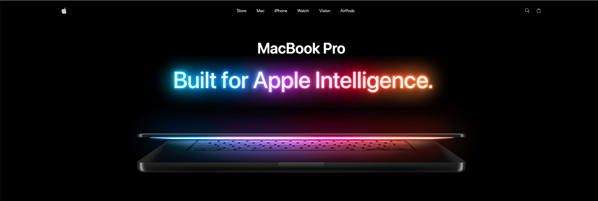

# 🍏 MacBook GSAP Interactive Landing Page

An immersive, Apple-inspired interactive landing page built with modern frontend technologies, focusing on **scroll-driven storytelling**, **smooth animations**, and **high-performance UI rendering**.

🔗 **Live Demo:** https://macbook-r3f-gsap.vercel.app/

---

## 📸 Preview



---

## ✨ Overview

This project is a **cinematic product experience** inspired by Apple's product pages, designed to showcase advanced frontend engineering techniques using **GSAP animations and smooth scroll interactions**.

It delivers a **visually rich, performance-optimized UI** that reacts seamlessly to user scroll and interaction, mimicking premium product storytelling experiences.

The landing page highlights a MacBook-style product with:

- Scroll-based transitions
- Animated text reveals
- Section-based storytelling
- Smooth motion and easing effects

---

## 🚀 Key Features

- 🎬 **Scroll-driven animations** powered by GSAP
- ⚡ **High-performance rendering** with optimized animation timelines
- 🧭 **Section-based storytelling UX**
- 🎯 **Pixel-perfect Apple-inspired UI**
- 📱 **Responsive design across devices**
- 🧩 Modular and scalable component structure

---

## 🛠️ Tech Stack

- **React / Next.js**
- **GSAP (GreenSock Animation Platform)**
- **Three.js / React Three Fiber** _(if applicable)_
- **Tailwind CSS / CSS Modules**
- **Vercel (Deployment)**

---

## 🧠 Architecture & Approach

The project is structured around a **component-driven architecture**, where each section of the page represents a storytelling block.

### Key Concepts:

- **GSAP Timelines**
  - Centralized animation control
  - Smooth sequencing between sections

- **ScrollTrigger Integration**
  - Sync animations with scroll position
  - Pinning and scrubbing effects

- **Separation of Concerns**
  - UI components isolated from animation logic
  - Reusable animation hooks/utilities

---

## 📂 Project Structure

```text
src/
│
├── components/ # Landing page components (Hero, Features, etc.)
├── constants/ # Static data used
├── store/ # Zustand state management store
├── App.tsx/ # Application file that hold rendered components
├── index.css/ # Used styles and reusable classes definitions
└── main.tsx/ # Root file to render the Application
```

---

## ⚙️ Getting Started

### 1. Clone the repository

```bash
git clone https://github.com/Hazem-GitHub/mackbook-r3f-gsap-landing-page.git
cd mackbook-r3f-gsap-landing-page
```

### 2. Install dependencies

```bash
npm install
```

### 3. Run development server

```bash
npm run dev
```

### 4. Build for production

```bash
npm run build
npm start
```
